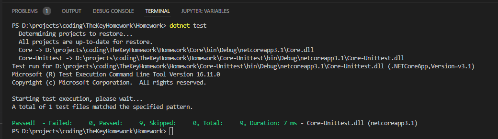
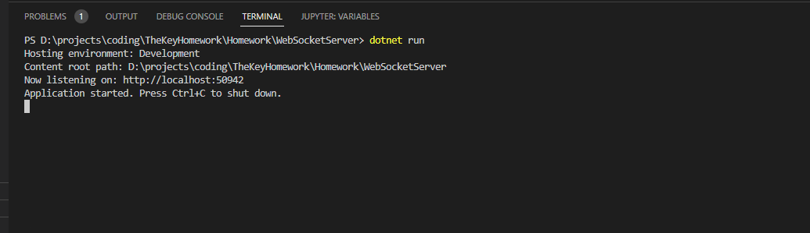

# TheKeyHomework

## How to use:

### Prerequisites:

* Clone this git repositroy
* Download and install the .NET Core SDK 3.1.421 from: https://dotnet.microsoft.com/en-us/download/dotnet/3.1 for your desired platfrom.
The project surely also works with .NET 5 but since my environment was already running .NET Core 3.1, I stayed with .NET Core 3.1.
* Although its not mandatory to run the project, I suggest to also download and install Visual Studio Code in its lastest version from: https://code.visualstudio.com/download. 
* As I do not have a Mac OS system, I was not able to test it on Mac OS on my own. I could only test it Ubuntu Linux and Windows 10 - 64 bit.

### Start Unittests:

* Browse to the 'Homwork' Folder in your local git repository
* Type: dotnet restore to the command line to restore missing nuget packages (xunit, NewtownsoftJson)
* Type: dotnet test to the command line

### Start backend websocket server and server that hosts the frontend 

* Browse to the 'Homwork/WebSocketServer' Folder in your local git repository
* Type: dotnet restore to the command line to restore missing nuget packages (NewtownsoftJson)
* Type: dotnet test to the command line
* Open a web browser and type 'http://localhost:50942' as the URL

* Browser should then show the wordcount per blogpost list

## Codebase
### Core library
* WordCounter.cs contains the logic to do the proper word counting of new posts and creating the resulting dictionary object structure
* WordpressApiResponseHelper.cs is a helper class that does the Wordpress API request and offers functionality to export the raw json data from it. It also contains functions for en-/decoding html strings and removing numbers and special characters from the input
### WebSocketServer
* Index.cshtml and stream.js contains the fronten presentation and javascript web socket messaging functionality
* StreamController.cs contains the backend web socket server functionality

## Sidewords
I had some issues with the socket server not recognizing when the client has disconnected. I expeted that this functionality is offered by the .net core framework. Unfortunately I needed to implement a heartbeat from the client to the server to recognize when the client is disconnected. Otherwise the web socket server would not terminate its thread and the process would eat up memory over time. Rethinking the heartbeat soloution, it might have been smarter to send heartbeats from the server to the client. So this would be a TODO for the future.

For the ease of testability I did not put efforts into a microservice architecture. But frontend and backaned can be split kind of eaily into different host processes. there are .net core docker images available: https://hub.docker.com/_/microsoft-dotnet-aspnet so that containerization is also pissble as a future TODO.
